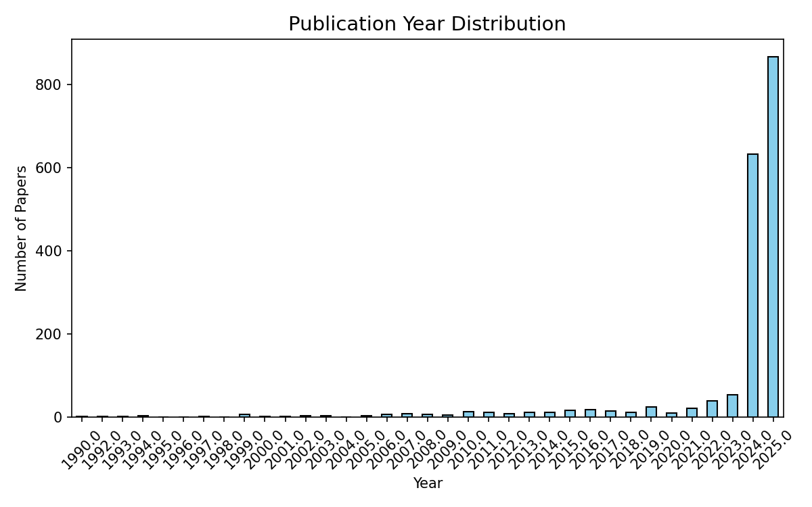
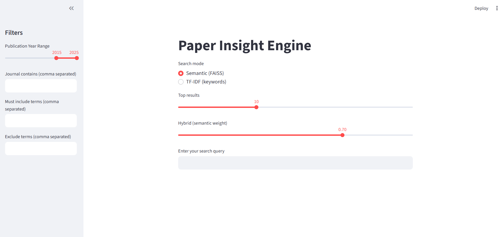
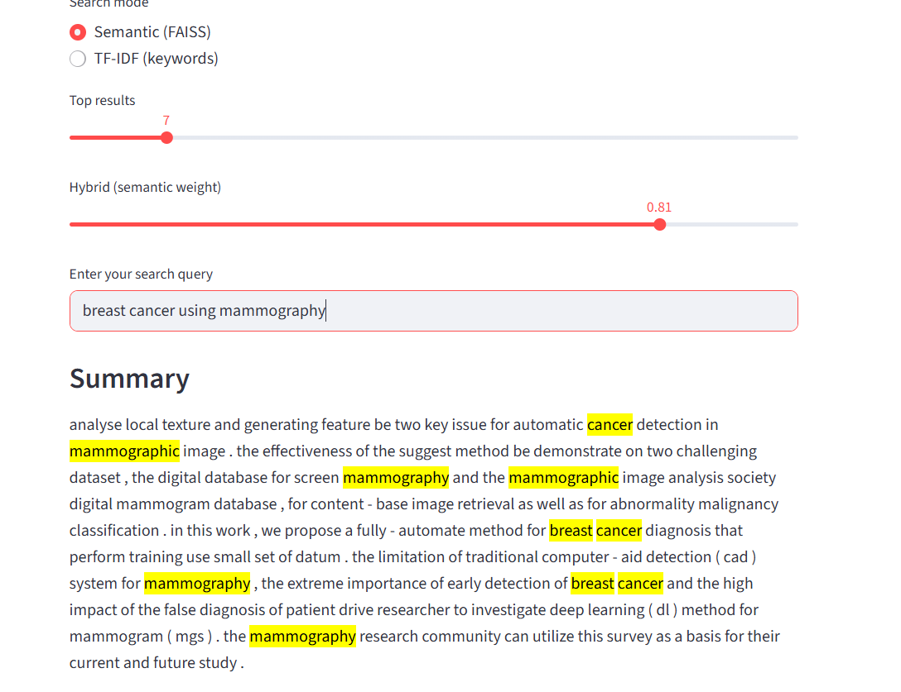
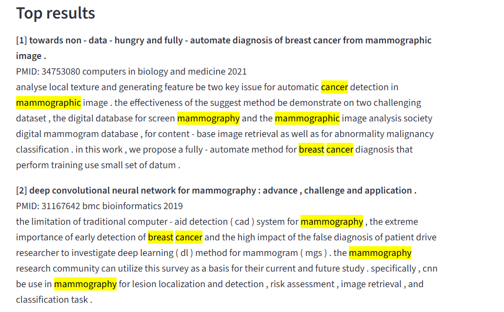
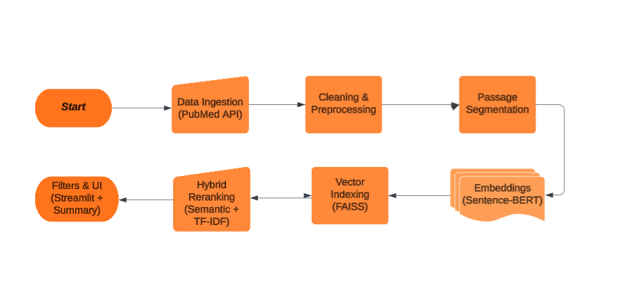

# Paper Insight Engine  

The **Paper Insight Engine** is a project built to make searching and learning from research papers easier and faster. Every day, thousands of new studies are published. For students, researchers, and professionals, this creates a huge challenge: *how do you keep up without drowning in information?*  

This project provides a solution — an AI-powered assistant that reads through research papers, organizes them, and helps you find exactly what you need in seconds.  

---

## 🎯 Main Objective  

The main goal of the Paper Insight Engine is to **help people discover the right research papers faster and with less effort**.  

- **For students** → writing literature reviews becomes easier and less time-consuming.  
- **For researchers** → discovering new work in their field is faster and more reliable.  
- **For businesses & labs** → it becomes possible to track important findings without missing key insights.  
- **For curious learners** → science is made more approachable, without needing technical skills.  

---

## 🛠 Project Steps  

### 1. Collecting and Cleaning Papers  
We start by gathering papers from **PubMed**, a trusted biomedical source. Raw data can be messy, so we clean and organize it — similar to arranging books neatly in a library.  

📊 *Figure 1: Overview of collected papers (example visualization of publication years or keyword distribution)*  
 Figure 1: Overview of collected papers

 

---

### 2. Organizing and Indexing  
Next, we prepare the papers so they can be searched by **meaning**, not just keywords. This means that if you ask:  

> *“AI for detecting cancer in medical images”*  

…the system will still find relevant papers, even if they use different words.  

---

### 3. Smart Search & Ranking  
The engine doesn’t just list results — it **prioritizes the most relevant ones**.  
- Handles **typos** and vague questions.  
- Allows **filters** (e.g., “only papers after 2020” or “exclude psychology papers”).  
- Surfaces the most important work first.  

📊 *Figure 2: Example search results in the dashboard (screenshot of Streamlit app)*  
 

---

### 4. Simple User Interface  
All of this is wrapped in a clean and easy-to-use dashboard. You don’t need coding skills — just type a question and explore the results.  

📊 *Figure 3: Search interface with filters*  

---

## 📊 Business Value and Applicability  

- **Save Time**: Hours of manual searching are reduced to minutes.  
- **Improve Decisions**: Ensures no important study is overlooked.  
- **Accessibility**: Non-technical users can access research directly.  
- **Scalability**: Can expand beyond biomedicine to technology, law, or any knowledge-heavy field.  

---

## 📈 Example Use Cases  

- A **professor** preparing for a new lecture quickly finds the latest studies.  
- A **student** builds a reference list for their thesis in hours, not weeks.  
- A **pharma company** tracks drug discovery research efficiently, supporting data-driven strategy.  

---

---

## 📑 Dataset Source  

The first version uses **PubMed abstracts and metadata**. This ensures high-quality, reliable information. The system, however, is flexible — in the future it can connect to sources like **arXiv**, **Semantic Scholar**, or private PDF collections.  

---

## 🔮 Future Roadmap  

- ✅ Build a working version with PubMed papers.  
- ✅ Create a simple search dashboard.  
- 🔲 Add typo-tolerant reranking.  
- 🔲 Add include/exclude term filters in the interface.  
- 🔲 Expand to multiple sources like arXiv and Semantic Scholar.  
- 🔲 Release a hosted demo version for wider access.  

📊 *Figure 4: Project workflow diagram (data → indexing → search → results)*  
  

---

## 📜 Summary  

The **Paper Insight Engine** is like having your own **digital librarian**:  
- You ask a question in plain language.  
- It searches through thousands of papers instantly.  
- It shows only the ones that matter.  

By saving time and surfacing key insights, this project makes research more accessible and efficient — whether you’re a student, researcher, business professional, or simply curious about the world.  

---

